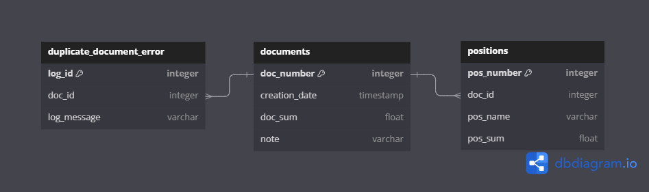

# docsAndPositions

## Описание
**docsAndPositions** - это сервис, имеющий в своем составе Master-Detail таблицы. 

Имеет две основные таблицы: со списком документов и со списком позиций. Позиции нельзя добавлять в таблицу, если нет соответствующего документа.

Также имеется дополнительная таблица со списком логов ошибок. Она сохраняет логи при попытке добавления в БД документа с уже существующим номером.
 
Реализован с использованием следующих инструментов: 
- **Java 17**
- **Maven**
- **Spring Boot**
- **Lombok**
- **PostgreSQL**

Перед запуском приложения необходимо развернуть базу данных с параметрами, указанными в проекте по пути `src\main\resources\application.properties`. В качестве графического инструмента управления БД можно использовать pgAdmin 4. 

Для проверки работоспсобности сервиса были написаны postman-тесты, которые находятся в папке **_postman_** в корне проекта.

## Функционльность проекта

### Функциональность эндпонта /documents

- **POST /documents** - создание нового документа.

- **GET /documents/{docNumber}** - получение документа по `docNumber`. Вместе с документом возвращается список его позиций.

- **PUT /documents** - редактирование документа.

- **DELETE /positions/{docNumber}** - удаление документа по его `docNumber`. Вместе с документом удаляются все связанные с ним позиции.

### Функциональность эндпонта /positions

- **POST /positions** - добавление новой позиции. Позицию невозможно добавить, если не существует соответствующего ему документа.

- **PUT /positions** - редактирование позиции документа.

- **DELETE /positions/{posNumber}** - удаление позиции по его `posNumber`.

### Функциональность эндпонта /duplicatelog

- **POST /duplicatelog** - добавление нового лога об ошибке при попытке добавления документа с дублирующим номером.

- **GET /duplicatelog/{docNumber}** - получение всех логов ошибок, связанных с документом, имеющим номер `docNumber`.

## Схема базы данных

Описание таблиц:
| Название таблицы | Описание |
| --- | --- |
| **documents** | таблица с документами |
| **positions** | таблица с позициями документов |
| **duplicate_document_error** | таблица с логами ошибок о попытке добавления документа с дублирующим номером |